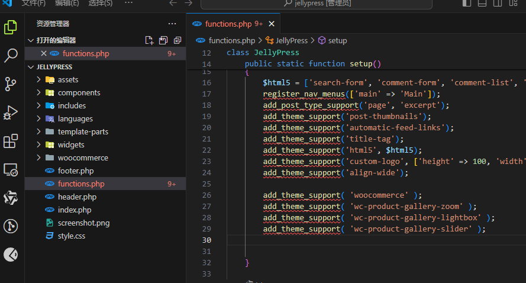
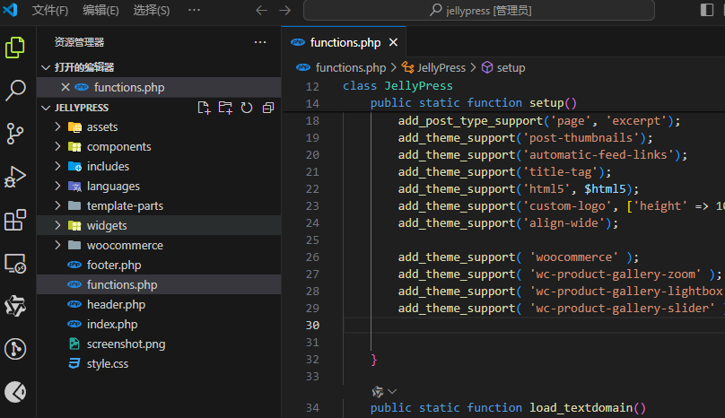

# WordPress 配置vscode开发环境

在开发插件或是主题时会用到WP中的函数或者变量等，普通情况下需要将vscode工作区打开到wordpress的根目录下。
为了只打开某个工作区，但是依旧保留WP代码提示，可以采取以下步骤：



## 安装必要的扩展:

- PHP Intelephense
  
## 配置 PHP 解析器

修改 `settings.jsopn` 文件，添加以下内容：

```json
{
  "php.validate.executablePath": "[修改为php.exe文件路径]",
  "php.executablePath": "[修改为php.exe文件路径]",
  "intelephense.environment.includePaths": [
    "[修改为wordpress的根目录路径]",
  ]
}
```

依次为：php解析器路径，php解析器路径，wordpress的根目录路径。

